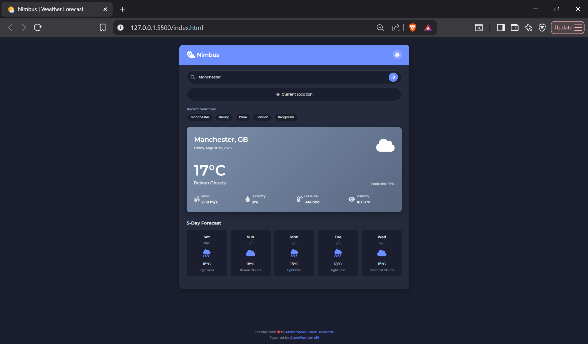
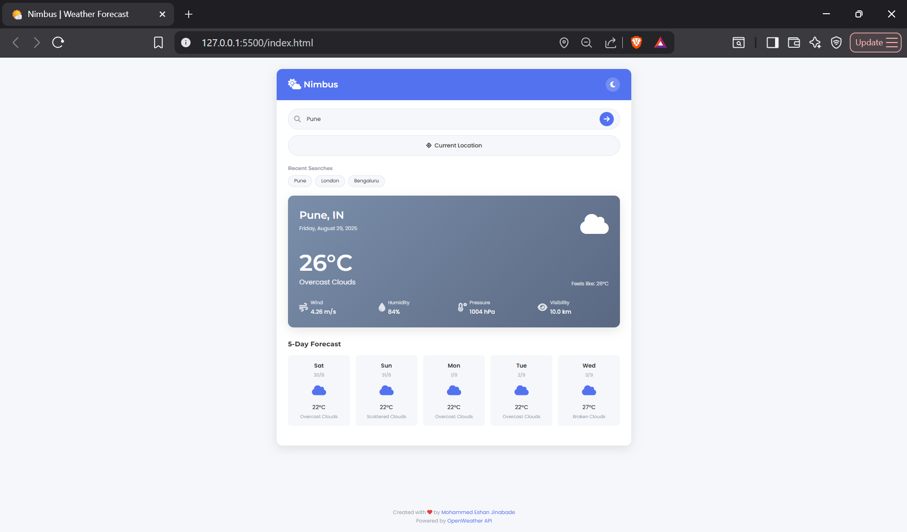

## 🌩️Nimbus

A modern, responsive weather forecast web app built with vanilla JavaScript, HTML, and CSS. Get current weather and a 5-day forecast for any city, with support for geolocation, search history, and light/dark themes.




## Features

- **Current Weather:** View real-time weather data for any city.
- **5-Day Forecast:** See daily forecasts with icons and temperature.
- **Geolocation:** Get weather for your current location.
- **Search History:** Quickly access recent city searches.
- **Theme Toggle:** Switch between light and dark modes.
- **Responsive Design:** Works great on desktop and mobile.

## Future Enhancements

- **Hourly Forecast:** Show weather by the hour.  
- **Unit Conversion:** Switch between °C and °F.  
- **Weather Alerts:** Notify users of severe conditions.  
- **Offline Mode:** Access recent data without internet.  
- **Favorites:** Save and quickly access preferred cities.  

## Demo

[Live Demo](https://nimbus-weather1.netlify.app/)

## Getting Started

### Prerequisites

- A modern web browser
- An [OpenWeatherMap API key](https://openweathermap.org/api)

### Installation

1. **Clone the repository:**
   ```sh
   git clone https://github.com/Eshan-07/Nimbus-Weather-App.git
   cd weather-app
   ```
2. **Add your API key:**

   - Create a new file named `apiKey.js` in the project root and add the following code, replacing the value with your OpenWeatherMap API key:

     ```js
     const OPEN_WEATHER_API_KEY = "YOUR_API_KEY_HERE";

     export default OPEN_WEATHER_API_KEY;
     ```

   - This file is imported by `script.js` to access your API key.

3. **Open the app:**
   - Open `index.html` in your browser.

## Project Structure

```
weather-app/
├── index.html        # Main HTML file
├── script.js         # JavaScript logic
├── styles.css        # App styling
└── README.md         # Project documentation
```

## API Reference

- [OpenWeatherMap API Docs](https://openweathermap.org/api)


## License

This project is open source and available under the [MIT License](LICENSE).


Created with ❤️ by [Mohammed Eshan Jinabade](https://github.com/Eshan-07)


